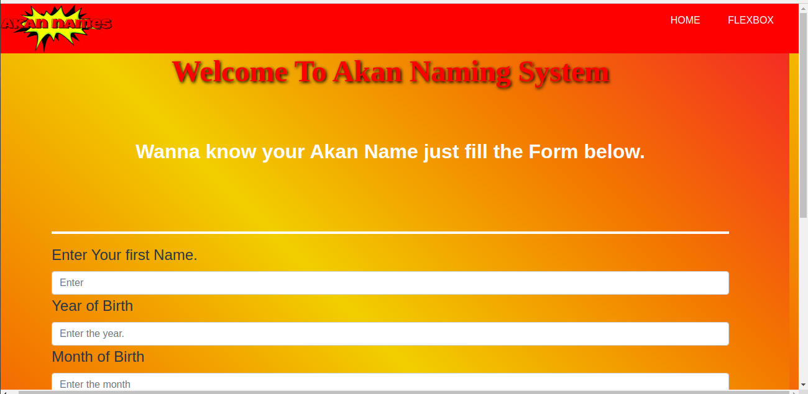
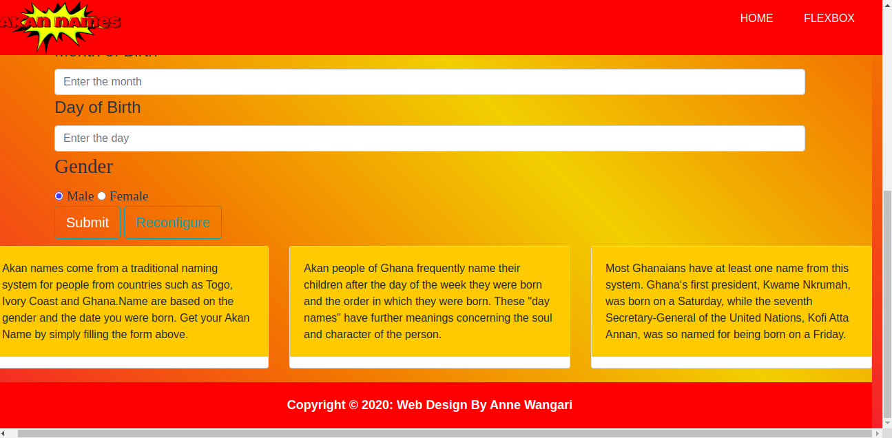
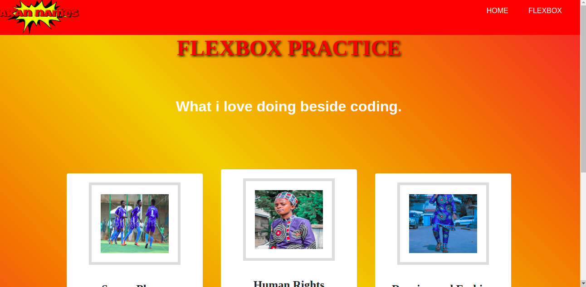

# Table of Contents

**.** Project Name

**.** Description

**.** Behaviour Driven Development

**.** Setup instruction

**.** Project Screenshot

**.** Technologies Used

**.** Contacts

**.** Author

**.** License

# AKAN NAMES

## DESCRIPTION
Akan names are derived from Ghanian culture. Frequently in Ghana, children are given their first name as a 'day name' which corresponds to the day in the week they were born. This site calculates the day of the week you were born and outputs your Akan name depending on your gender.

## Link to the repository on github
 https://github.com/Annewangari/Akan-Names.git

 ## Behaviour Driven Development
 An application that allows users to enter their gender and date of birth and come up with thier Ghananian name.

 | Gender | Date Of Birth | Day Of Birth | Akan Name Output |
| ----------- | ----------- | ----------- | ----------- |
| Female | 16-08-1997 | Saturday | Ama |
| Male | 16-08-1997 | Saturday | Kwame |

# Setup Instruction
## First Method
1. In the terminal Navigate to the directory you want the project to reside in e.g (cd-/Desktop)

2. Clone the project (https://github.com/Annewangari/Akan-Names.git)

3. Navigate into the created folder (cd-Akan-Names)

4. Open the project with vscode (code .)

## Second Method
1. Download the Project's zip files

2. Extract it to the folder of your choice

3. In a text editor open the project's folder

# Project Screenshot

 
 Landing Page

 

 Section to fill and submit the form

 

 flexbox practice

# Technologies Used

 | Technology | Function |
| ----------- | ----------- |
| Html| For the structure and layout of web document |
| Css | For styling and designing website |
| Javascript | For functionality of the website |
| Bootstrap | For UI interface elements such as buttons and forms |

# Contact

Incase of any question, feedback or contribution, kindly reach out to me via.

Email

annekare3@gamail.com
 
 Phone Number

 +254704326658

 # Athour

 Anne Wangari Mwangi

 # Lincense

 MIT Lincense:

 Copyright (c) 2020 Annewangari
